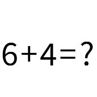

# algebraic-captcha

Generate CAPTCHA from algebraic equation

[](https://www.npmjs.org/package/algebraic-captcha)
[](https://www.npmjs.com/package/algebraic-captcha)
[](https://travis-ci.org/tormozz48/algebraic-captcha)
[](http://commitizen.github.io/cz-cli/)

## Install

Install package as yet another npm package:

```bash
npm install algebraic-captcha
```

Also [yarn](https://yarnpkg.com/en/) package manager can be used:

```bash
yarn add algebraic-captcha
```

## Usage

Simple example.

```js
const {AlgebraicCaptcha} = require('algebraic-captcha');

async function generateCaptcha() {
    const algebraicCaptcha = new AlgebraicCaptcha({
        width: 200,
        height: 200,
        background: '#ffffff',
        color: '#000000',
        minValue: 1,
        maxValue: 10,
        operandAmount: 1,
        operandTypes: ['+', '-'],
        mode: 'formula',
        targetSymbol: '?'
    });

    const {image, answer} = await algebraicCaptcha.generateCaptcha();
}
```

Here:

-   `answer` - is numeric answer for given equation (10 for this case).
-   `image` - image buffer
    

Using inside express middleware.

```js
const express = require('express');
const session = require('express-session');
const {AlgebraicCaptcha} = require('algebraic-captcha');

const app = express();
const algebraicCaptcha = new AlgebraicCaptcha({});

app.use(session({secret: 'my awesome session', resave: true}));

app.get('/captcha', async (req, res) => {
    const {image, answer} = await algebraicCaptcha.generateCaptcha();
    req.session.captcha = answer;
    res.writeHead(200, {'Content-Type': 'image/png'});
    res.end(image);
});

app.listen(3000);
```

## Options

Available options:

#### `width`.

Width of generated image in pixels

-   minimal value: 20
-   minimal value: 1000
-   default value: 200

#### `height`

Height of generated image in pixels

-   minimal value: 20
-   minimal value: 1000
-   default value: 100

#### `minValue`

Min operand value used in equation

-   minimal value: 1
-   minimal value: 10000
-   default value: 1

#### `maxValue`

Max operand value used in equation

-   minimal value: 1
-   minimal value: 10000
-   default value: 1

#### `background`

Background color of captcha image

-   default value: '#ffffff'

#### `color`

Text color of captcha image

-   default value: '#000000'

#### `operandAmount`

Number of equation operations

-   default value: 1

#### `operandTypes`

Array of used math operators

-   default value: ['+', '-']

#### `mode`

Can have two available values: `formula`, `equation`

In `formula` mode anwer placeholder will be put to the last position of generated string, such as:

```
5 + 2 = ?
```

In `equation` mode answer placeholder will be put on random operand position except last:

```
5 + ? = 7 //(or ? + 2 = 7)
```

-   default value: 'formula'

#### `targetSymbol`

Symbol which is used as placeholder for answer

-   default value: '?'

## Development

Clone repository or its fork to local filesystem

```bash
git clone https://github.com/tormozz48/algebraic-captcha.git
```

Install npm dependencies:

```bash
npm install
```

Here are some suitable commands that can be used during development:

-   `npm run build` - compile [typescript](https://www.typescriptlang.org/index.html) files
-   `npm run lint` - run [tslint](https://palantir.github.io/tslint/) verification tool
-   `npm test` - run tests with [mocha](https://mochajs.org)
-   `npm run watch` - launch watcher for compile source files during development

**Important** Use command `npm run cm` for commit your changes instead of `git commit`.

## License

Apache-2.0

## Support

Bugs, PRs, comments, suggestions welcomed!

Maintainer: [Andrey Kuznetsov](andrey.kuznetsov48@yandex.ru)
